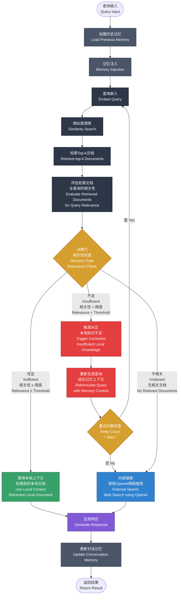

# Corrective RAG with Memory

整合了记忆机制和纠正机制的 RAG 系统架构。

## 系统架构流程图

## 系统说明

### 核心特性

1. **记忆机制**（深灰色节点）
   - 流程开始时加载历史对话记忆
   - 所有路径结束时更新对话记忆
   - 为多轮对话提供上下文连贯性

2. **纠正机制**（决策门 + 多路径）
   - 评估检索文档的相关性
   - 根据阈值智能分流到不同处理路径

### 三条处理路径

#### 路径 A - 充足路径（绿色）
- **触发条件**：Relevance ≥ Threshold
- **处理流程**：
  - 使用检索到的本地文档
  - 直接生成响应
  - 更新记忆并返回结果

#### 路径 B - 纠正路径（红色）
- **触发条件**：Relevance < Threshold
- **处理流程**：
  - 触发纠正机制
  - 结合记忆上下文重新生成查询
  - 检查重试次数
    - 未超限：重新执行检索流程
    - 超限：转向外部搜索
- **防护机制**：最大重试次数限制，避免无限循环

#### 路径 C - 外部搜索路径（蓝色）
- **触发条件**：
  - 完全不相关的文档
  - 或纠正路径重试超限
- **处理流程**：
  - 使用外部搜索（OpenAI Web Search）
  - 生成响应
  - 更新记忆并返回结果

### 关键整合点

- **记忆 + 查询处理**：Memory Injection 增强查询理解
- **记忆 + 纠正机制**：Reformulate Query 时结合记忆上下文
- **统一记忆更新**：所有路径最终都更新对话记忆
- **智能降级**：纠正失败时自动降级到外部搜索

## 优势

1. 提高检索准确性（纠正机制）
2. 增强多轮对话能力（记忆机制）
3. 智能错误处理（重试 + 降级）
4. 完整的上下文管理（全流程记忆追踪）
